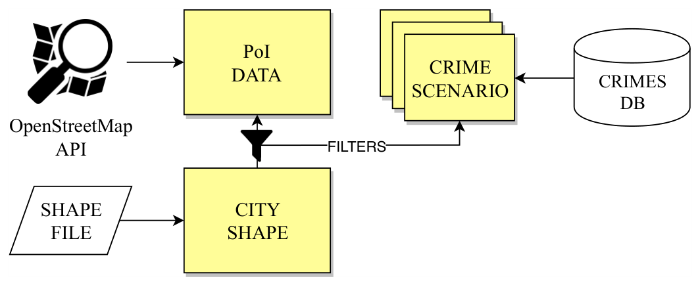
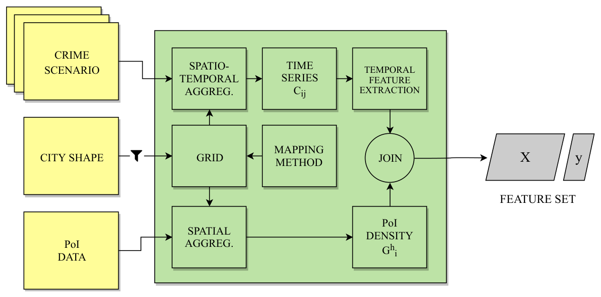
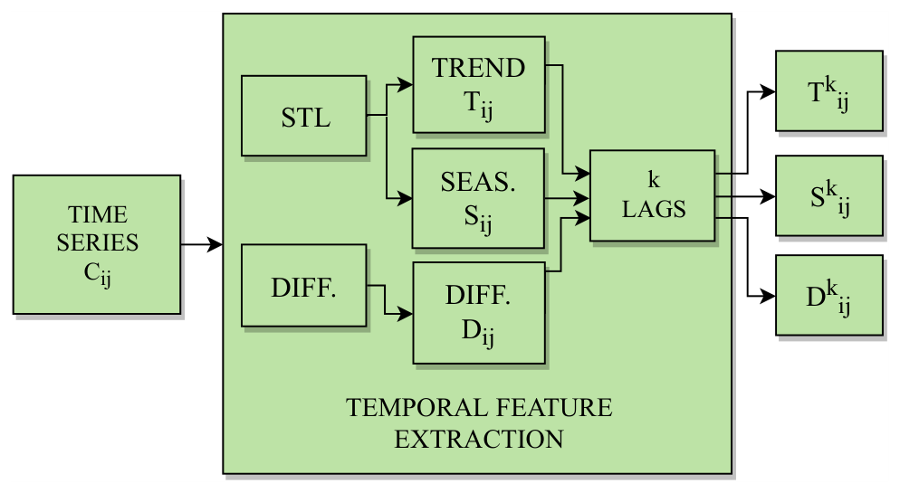
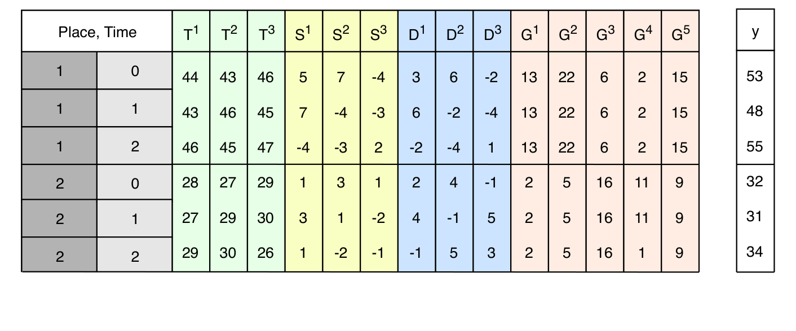
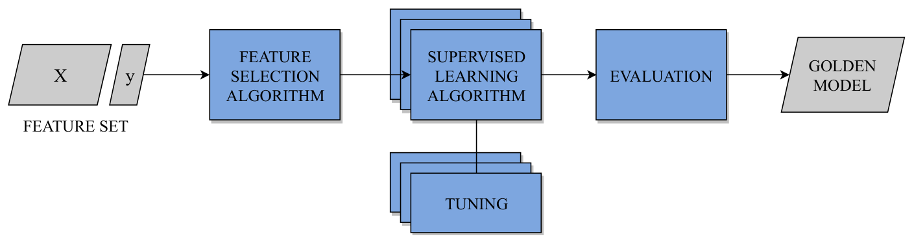
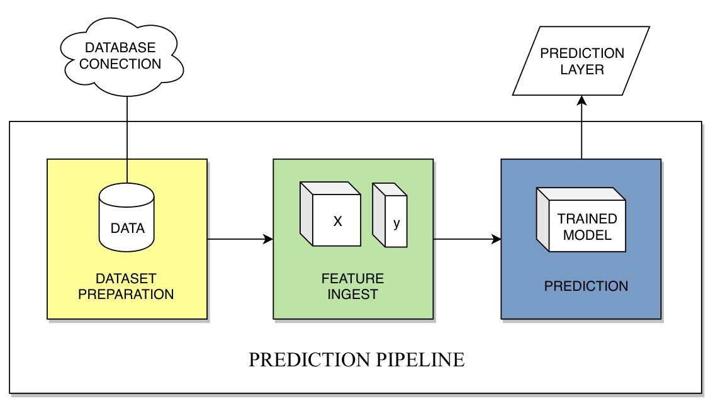

# Predspot

[](https://github.com/adaj/predspot/actions/workflows/ci.yml)
[](https://adaj.github.io/predspot/)
[](https://pypi.org/project/predspot/)
[](https://pypi.org/project/predspot/)
[](https://github.com/adaj/predspot/blob/master/LICENSE)

## Overview 📖

Predspot is a Python library for spatio-temporal crime prediction and hotspot
detection. It turns a table of georeferenced, timestamped crime events into a
grid of *places* and a sequence of *periods*, builds time series features for
every place and trains a scikit-learn model to forecast where the next period's
hotspots will be.

Key features:

- Spatio-temporal crime mapping: kernel density estimation (KDE) on point grids,
  or event counts on hexagonal and square grids, at daily, weekly or monthly resolution
- Time series feature engineering: lagged autoregressive, difference, seasonal and
  trend features (STL decomposition)
- A prediction pipeline that accepts any scikit-learn regressor, with time series
  cross-validation and recursive multi-step forecasts
- Study areas fetched from OpenStreetMap by name
- A synthetic crime generator (hotspots, trend, annual, weekly and hourly patterns)
  to try everything without real data

Full documentation, with a quickstart, a user guide and the API reference, lives at
**https://adaj.github.io/predspot/**. A complete, executed walkthrough for the city
of Natal is in [`examples/natal.ipynb`](https://github.com/adaj/predspot/blob/master/examples/natal.ipynb).

## How to use? 🚀

Install from PyPI (Python 3.10 or newer):

```bash
pip install predspot              # core
pip install "predspot[contour]"   # + GeoJSON contour export (geojsoncontour)
pip install "predspot[examples]"  # + jupyter, to run the example notebooks
```

Not on PyPI yet? Install straight from GitHub:

```bash
pip install "git+https://github.com/adaj/predspot.git"
```

Basic usage example:

```python
from predspot import Dataset, PredictionPipeline
from predspot.crime_mapping import KDE, create_gridpoints
from predspot.feature_engineering import Seasonality, Trend, Diff
from predspot.utilities import PandasFeatureUnion
from sklearn.ensemble import RandomForestRegressor

# crimes_df needs `tag`, `t`, `lon`, `lat` columns;
# study_area_gdf is a GeoDataFrame with the boundary of the study area
dataset = Dataset(crimes_df, study_area_gdf)

# Monthly KDE on a 1 km point grid, lag features, random forest
pipeline = PredictionPipeline(
    mapping=KDE(tfreq='M', grid=create_gridpoints(study_area_gdf, resolution=1)),
    fextraction=PandasFeatureUnion([
        ('seasonal', Seasonality(lags=12)),
        ('trend', Trend(lags=12)),
        ('diff', Diff(lags=12))
    ]),
    estimator=RandomForestRegressor()
)

# Fit and predict the next month for every grid point
pipeline.fit(dataset)
predictions = pipeline.predict()
```

Prefer counting events per cell instead of a density surface? Use the
hexagonal grid with `QuadratCount`:

```python
from predspot.crime_mapping import QuadratCount, create_gridhexagonal

mapping = QuadratCount(tfreq='W', grid=create_gridhexagonal(study_area_gdf, resolution=1))
```

### Study area from OpenStreetMap and synthetic data

You do not need real data to try Predspot. Fetch a city boundary from
OpenStreetMap and generate synthetic events
with spatial hotspots and realistic temporal patterns (trend, annual cycle,
day-of-week and hour-of-day profiles):

```python
from predspot import Dataset, get_city_shape, generate_crimes

city = get_city_shape("Natal, RN, Brazil")
crimes = generate_crimes(city, n_events=5000, n_hotspots=4,
                         start="2019-01-01", end="2020-12-31", seed=0)
dataset = Dataset(crimes, city)
dataset.plot()
```

Or run the default pipeline in one call:

```python
from predspot.pipeline import generate_testdata, run_prediction_pipeline

crimes, study_area = generate_testdata(2000, '2019-01-01', '2020-12-31', seed=0)
predictions, pipeline = run_prediction_pipeline(crimes, study_area, grid_resolution=1)
print(pipeline.evaluate('r2', cv=3))
```

### Input data format 📊

The crime data should be a pandas DataFrame with the following required columns:

- `tag`: crime type
- `t`: timestamp
- `lon`: longitude (WGS84 degrees)
- `lat`: latitude (WGS84 degrees)

The study area should be a GeoDataFrame (with a CRS) defining the boundaries
of interest.

## The Predspot framework 🧭

Predspot implements the framework described in Chapter 3 of the master's
thesis [*Predspot: predicting crime hotspots with machine learning*](https://repositorio.ufrn.br/server/api/core/bitstreams/3655b8e1-2f32-4ce9-af9c-0e6b64d7af84/content)
(Araújo Jr., 2019). The framework is split into two phases, mirroring the
training and prediction steps of a machine learning system: **model
selection**, where a model is trained, evaluated and saved, and **prediction
service**, where that model is used operationally, period after period. The
figures below are reproduced from the thesis.

### Model selection

**1. Dataset preparation** *(Figure 7)* — everything starts from three inputs:
a crime database, the city shape and, optionally, auxiliary Points of Interest
(PoI) from OpenStreetMap.

<p align="center"></p>

- Crime records must carry at least latitude, longitude, timestamp and crime type.
- The city shape acts as a spatial filter: events and PoI outside the boundary are dropped,
  along with duplicates and "default" locations assigned to badly registered events.
- Crimes are split into **crime scenarios** (one per crime type, and possibly
  per day/night period) that are modelled separately, since aggregating different
  crime types blurs their distinct spatial patterns.
- In the package: `Dataset` (validation, WGS84 points) and `get_city_shape` /
  `load_study_area` (city boundary from OpenStreetMap).

**2. Feature ingest** *(Figures 8, 9 and 10)* — the step that assembles the
feature matrix `X` and the target `y`. Before it starts, two units of analysis
are chosen: the **spatial unit** (a grid derived from the crime mapping method)
and the **temporal unit** (daily, weekly or monthly samples — finer units give
sparser, harder-to-predict series).

<p align="center"></p>

- **Spatio-temporal aggregation**: the mapping method (KDE on a point grid, or
  counts on polygonal cells) turns the events of each period into one value per
  grid cell, producing the time series `C_ij` of cell *i* at period *j*.
- **Temporal feature extraction** *(Figure 9)*: each cell's series is decomposed
  with STL into **trend** (`T`) and **seasonal** (`S`) components, and
  **differenced** (`D`); the features are the *k* most recent lags of each
  component, and the target is the series value one period ahead.

<p align="center"></p>

- **Spatial aggregation of PoI** (optional): the density of each PoI category
  around each cell (`G`) describes places geographically, complementing the
  temporal features.
- **Join**: temporal and geographic features are joined into one row per
  `(place, time)` pair — the layout shown in Figure 10.

<p align="center"></p>

- In the package: `create_gridpoints` / `create_gridhexagonal` /
  `create_gridsquares` (grid), `KDE` / `QuadratCount` (spatio-temporal
  aggregation), `Trend`, `Seasonality`, `Diff`, `AR` and `PandasFeatureUnion`
  (temporal feature extraction and join). PoI features are not part of the
  current package release.

**3. Machine learning modelling** *(Figure 11)* — the feature set feeds a
model-agnostic training loop.

<p align="center"></p>

- **Feature selection** first: noisy lags and PoI layers are filtered by a
  learning-based selector (an embedded, tree-based method in the thesis).
- **Several supervised algorithms** are trained and **tuned**, rather than
  betting on a single one; the thesis compared random forests and gradient boosting.
- **Evaluation** uses time series K-fold cross-validation (train on the first
  *k* folds, test on fold *k*+1), so no information from the future leaks into
  training. The best model per crime scenario is the **golden model**, saved
  together with its selected features.
- In the package: `PredictionPipeline` (with `FeatureScaling`,
  `FeatureSelection` and `Model` wrappers and `evaluate()` for the time series CV).

### Prediction service

**4. Prediction pipeline** *(Figure 12)* — the model selection steps are
tailored for operation.

<p align="center"></p>

- For each new period, only the most recent events are loaded (enough to
  compute the *k* lags), filtered and split into scenarios as before.
- The spatio-temporal aggregation and temporal feature extraction are repeated;
  PoI features are reused, since they do not change over time.
- The previously selected features are kept and the golden model returns the
  crime incidence level `y_i` of every place *i* one period ahead — a
  prediction layer ready to be mapped. The process repeats every period.
- In the package: `PredictionPipeline.predict()` appends each forecast to the
  series and advances one period, so repeated calls walk forward in time.

**5. Web service** — the thesis also outlines how to wrap the pipeline in a
decoupled service (with a file *volume* for data, models and predictions, and
an ETL controller triggering the pipeline each period) that serves predictions
as GeoJSON to existing GIS tools. That layer is outside the scope of this
package, which covers the model selection phase and the prediction pipeline.

## Resources 📚

- Master's thesis (full description of the framework, evaluation on Natal and
  Boston, feature importance analysis): Araújo Jr., A. (2019).
  [*Predspot: Predicting Crime Hotspots with Machine Learning*](https://repositorio.ufrn.br/server/api/core/bitstreams/3655b8e1-2f32-4ce9-af9c-0e6b64d7af84/content).
  M.Sc. dissertation, PPgSC/UFRN, Natal, Brazil.
- The earlier version of the framework: Araújo et al. (2018), *Towards a crime
  hotspot detection framework for patrol planning* (HPCC/SmartCity/DSS).
- Methods worth reading about: kernel density estimation for hotspot mapping
  (Chainey, Tompson & Uhlig, 2008), STL time series decomposition (Cleveland
  et al., 1990) and time series cross-validation (Bergmeir, Hyndman & Koo, 2018).

## Cite us

If you use Predspot in your research, please cite us:

APA:
```
Araújo Jr., A. (2019). Predspot: Predicting Crime Hotspots with Machine Learning. Master's dissertation, UFRN (Universidade Federal do Rio Grande do Norte), Natal, Brazil.

Araújo, A., Cacho, N., Bezerra, L., Vieira, C., & Borges, J. (2018, June). Towards a crime hotspot detection framework for patrol planning. In 2018 IEEE 20th International Conference on High Performance Computing and Communications; IEEE 16th International Conference on Smart City; IEEE 4th International Conference on Data Science and Systems (HPCC/SmartCity/DSS) (pp. 1256-1263). IEEE.
```

or bibtex:
```
@mastersthesis{araujo2019predspot,
  title={Predspot: Predicting crime hotspots with machine learning},
  author={Araujo, Adelson},
  year={2019},
  school={Universidade Federal do Rio Grande do Norte},
  url={https://repositorio.ufrn.br/server/api/core/bitstreams/3655b8e1-2f32-4ce9-af9c-0e6b64d7af84/content}
}

@inproceedings{araujo2018towards,
  title={Towards a crime hotspot detection framework for patrol planning},
  author={Ara{\'u}jo, Adelson and Cacho, N{\'a}dia and Bezerra, Lucas and Vieira, Carlos and Borges, Jo{\~a}o},
  booktitle={2018 IEEE 20th International Conference on High Performance Computing and Communications; IEEE 16th International Conference on Smart City; IEEE 4th International Conference on Data Science and Systems (HPCC/SmartCity/DSS)},
  pages={1256--1263},
  year={2018},
  organization={IEEE}
}
```

## Development ⚡

Predspot has five main modules:

- `dataset_preparation`: preparing and managing crime datasets and study areas.
- `crime_mapping`: spatial and temporal crime mapping — point, hexagonal and
  square grids, KDE density surfaces, per-cell counts (`QuadratCount`) and
  study areas from OpenStreetMap.
- `feature_engineering`: time series feature engineering (seasonality, trend,
  difference and autoregressive lags).
- `ml_modelling`: the prediction pipeline and model evaluation.
- `synthetic`: synthetic crime events (hotspots + temporal patterns) inside any study area.

From source, for development:

```bash
git clone https://github.com/adaj/predspot.git
cd predspot
pip install -e ".[dev,contour,examples]"
ruff check src tests   # lint
pytest                 # ~10 s
```

See [CONTRIBUTING.md](https://github.com/adaj/predspot/blob/master/CONTRIBUTING.md)
for the release process and
[CHANGELOG.md](https://github.com/adaj/predspot/blob/master/CHANGELOG.md) for
what changed between versions.

## Contributing 💡

Contributions are welcome! Please feel free to submit a Pull Request.

Guidelines for contributing:
1. Fork the repository
2. Create your feature branch
3. Commit your changes
4. Push to the branch
5. Create a new Pull Request

## License 📜

BSD 3-Clause

## Status 🚧

Predspot started as part of a master's thesis (2018-2019) and was revived in
2026. The code base now targets Python 3.10+ with current versions of pandas
(>= 2.2), GeoPandas (>= 1.0), scikit-learn and statsmodels, and is covered by a
test suite and continuous integration. It remains research software: use it as
a reference implementation and adapt it to your own data.
