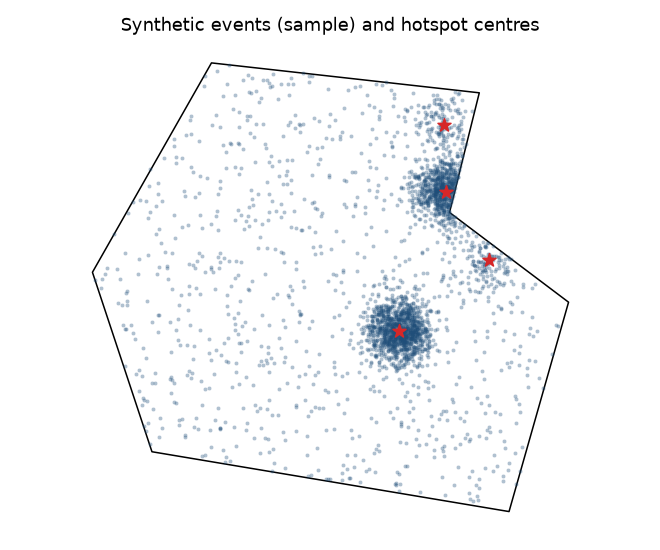

# Quickstart

This walkthrough goes from nothing to a hotspot forecast in a few minutes, using
synthetic data so you can run it as is. Every step is explained in depth in the
[user guide](../guide/concepts.md).

## 1. A study area

Predspot needs the boundary of the region you are studying as a GeoDataFrame
with a CRS. The easiest way is to fetch it from OpenStreetMap
(`pip install "predspot[osm]"`):

```python
from predspot import load_study_area

study_area = load_study_area("Natal, Rio Grande do Norte, Brazil")
```

Any other source works too — a shapefile or GeoJSON read with
`geopandas.read_file`, or a simple box:

```python
import geopandas as gpd
from shapely.geometry import box

study_area = gpd.GeoDataFrame(geometry=[box(-35.30, -5.90, -35.20, -5.80)], crs="EPSG:4326")
```

## 2. Crime events

Your data must be a pandas DataFrame with four columns:

| Column | Meaning |
|--------|---------|
| `tag` | Crime type (any string) |
| `t` | Timestamp (anything `pandas.to_datetime` understands) |
| `lon`, `lat` | Coordinates in WGS84 degrees |

No data at hand? Generate realistic synthetic events inside the study area:

```python
from predspot import generate_crimes

crimes = generate_crimes(study_area, n_events=5000, n_hotspots=4,
                         start="2019-01-01", end="2020-12-31", seed=0)
crimes.head()
```

Wrap both in a [`Dataset`][predspot.dataset_preparation.Dataset]:

```python
from predspot import Dataset

dataset = Dataset(crimes, study_area)
dataset.plot()   # study area + a sample of events
```

<figure markdown="span">
  { width="480" }
</figure>

## 3. Build and fit a pipeline

A [`PredictionPipeline`][predspot.ml_modelling.PredictionPipeline] chains a
spatio-temporal **mapping**, a **feature extraction** step and a scikit-learn
**estimator**:

```python
from sklearn.ensemble import RandomForestRegressor

from predspot import PredictionPipeline, PandasFeatureUnion
from predspot.crime_mapping import KDE, create_gridpoints
from predspot.feature_engineering import Seasonality, Trend, Diff

grid = create_gridpoints(study_area, resolution=1)   # points every 1 km

pipeline = PredictionPipeline(
    mapping=KDE(tfreq="M", grid=grid),               # monthly density per point
    fextraction=PandasFeatureUnion([
        ("seasonal", Seasonality(lags=6)),
        ("trend", Trend(lags=6)),
        ("diff", Diff(lags=6)),
    ]),
    estimator=RandomForestRegressor(n_estimators=100, random_state=0),
    random_state=0,
)
pipeline.fit(dataset)
```

[`build_default_pipeline`][predspot.pipeline.build_default_pipeline] builds
exactly this kind of pipeline (with scaling and feature selection) in one call.

## 4. Evaluate and forecast

```python
pipeline.evaluate("r2", cv=3)     # one score per time series fold
forecast = pipeline.predict()     # DataFrame indexed by (t, places)
```

`forecast` holds the predicted density for the month after the last observed
one, for every grid point. Join it with the grid to map it:

```python
hot = pipeline.grid.join(forecast.droplevel("t"))
hot.plot(column="crime_density", cmap="magma", markersize=12, legend=True)
```

Calling `predict()` again forecasts the following month, and so on — each
forecast is appended to the series and the features are recomputed.

## 5. Prefer counts on hexagons?

Swap the mapping and the grid; everything else stays the same:

```python
from predspot.crime_mapping import QuadratCount, create_gridhexagonal

mapping = QuadratCount(tfreq="W", grid=create_gridhexagonal(study_area, resolution=1))
```

<figure markdown="span">
  { width="900" }
  <figcaption>The same month mapped with KDE on a point grid (left) and with event counts on a hexagonal grid (right).</figcaption>
</figure>
