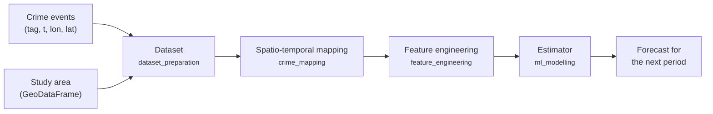

# How Predspot works

Predspot frames hotspot prediction as a **supervised time series problem on a
spatial grid**. The library is organised around four stages that map onto four
modules:

## 1. Dataset

A [`Dataset`][predspot.dataset_preparation.Dataset] is a validated pair of
crime events (a DataFrame with `tag`, `t`, `lon`, `lat`) and a study area
(a GeoDataFrame with a CRS). The events become a GeoDataFrame of points in
WGS84. See [Data and study areas](data.md).

## 2. Spatio-temporal mapping

The study area is discretised into **places** — a grid of points, hexagons or
squares — and time into **periods** (`tfreq`: daily, weekly or monthly). A
mapping assigns a value to every `(period, place)` pair:

- [`KDE`][predspot.crime_mapping.KDE] fits a Gaussian kernel density estimate
  to the events of each period and evaluates it at the grid points (the
  default, and the approach of the original thesis);
- [`QuadratCount`][predspot.crime_mapping.QuadratCount] counts the events
  falling in each polygonal cell.

Both return the same object: a `pandas.Series` named `crime_density` with a
`(t, places)` MultiIndex — the *spatio-temporal series*. See
[Grids and mapping](mapping.md).

## 3. Feature engineering

For every place, the history of the series is turned into lagged features.
Each feature class first transforms the series (identity, first difference,
STL seasonal or trend component) and then builds `lags` columns with the
previous values. A [`PandasFeatureUnion`][predspot.utilities.PandasFeatureUnion]
concatenates several of them. The result is a feature matrix indexed by
`(t, places)`, with one extra row per place for the period *after* the last
observed one — the row the model will forecast. See
[Feature engineering](features.md).

## 4. Estimator

Any scikit-learn regressor learns to map the features at `t` to the series
value at `t`. Because every row is a `(period, place)` pair, a single model
is shared by all places, and the spatial structure enters through the mapping
and the features rather than through the model. `PredictionPipeline` shuffles
the rows for training, evaluates with
[`TimeSeriesSplit`](https://scikit-learn.org/stable/modules/generated/sklearn.model_selection.TimeSeriesSplit.html)
and forecasts the next period. See [Prediction and evaluation](modelling.md).

## Design choices worth knowing

- **Resolutions are in kilometres.** Grid functions convert them to degrees
  using the length of a degree at the equator, so cells are slightly
  distorted away from it; for city-scale study areas this is negligible.
- **Grids are built in WGS84 and re-projected to the study area's CRS.**
  Cell centroids are computed in a projected CRS, so `lon`/`lat` columns
  are accurate.
- **KDE bandwidth is estimated once.** With `bandwidth="silverman"` (or
  `"scott"`) the factor is estimated on the first period with at least three
  events and held fixed, so densities are comparable across periods. Pass a
  number to fix it yourself.
- **Periods with no events are kept** (zeros everywhere), and `start_time` /
  `end_time` can extend the series beyond the observed range.
- **Monthly periods use pandas' `ME` (month end) frequency.** You can keep
  writing `tfreq="M"`; it is translated internally.
