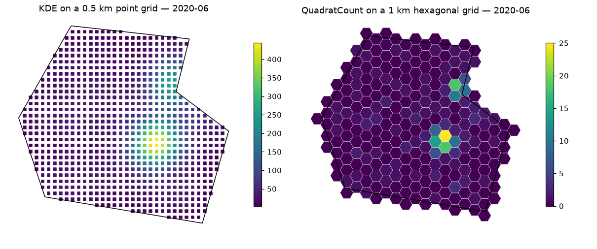

# Grids and spatio-temporal mapping

Mapping turns raw events into the **spatio-temporal series**: one value per
place and period. It is the step that defines what "hotspot" means in your
analysis.

## Grids

All grid functions take the study area and a `resolution` in **kilometres**,
and return a GeoDataFrame with `geometry`, `lon`, `lat` columns and an
index named `places`. Only cells intersecting the study area are kept.

| Function | Cells | Pairs with |
|----------|-------|------------|
| [`create_gridpoints`][predspot.crime_mapping.create_gridpoints] | points spaced `resolution` km apart | `KDE` (default) |
| [`create_gridhexagonal`][predspot.crime_mapping.create_gridhexagonal] | hexagons with the area of a `resolution` km square | `QuadratCount` |
| [`create_gridsquares`][predspot.crime_mapping.create_gridsquares] | squares of side `resolution` km | `QuadratCount` |

```python
from predspot.crime_mapping import create_gridpoints, create_gridhexagonal

points = create_gridpoints(study_area, resolution=0.5)
hexes = create_gridhexagonal(study_area, resolution=1)
hexes.plot(edgecolor="white")
```

Choosing a resolution is a trade-off: finer grids give more spatial detail
but more places to model (and, for KDE, more points to evaluate); the
original work used 250 m to 1 km for city-scale studies. Hexagons are
preferable to squares for counts because every neighbour is at the same
distance.

## Time frequency

`tfreq` sets the period: `"D"` (daily), `"W"` (weekly, Sunday-ending) or
`"M"` (monthly, month-end labels). Periods without events are kept with
zeros, and `start_time` / `end_time` can pad the series.

## KDE

[`KDE`][predspot.crime_mapping.KDE] fits a Gaussian kernel density estimate
(`scipy.stats.gaussian_kde`) to the event coordinates of each period and
evaluates it at the grid points. The result is a smooth density surface —
the classic hotspot map.

```python
from predspot.crime_mapping import KDE

mapping = KDE(tfreq="M", grid=points, bandwidth="silverman")
stseries = mapping.fit_transform(dataset.crimes)
stseries.head()
```

```
t           places
2019-01-31  0         12.31
            1         14.02
            ...
Name: crime_density, dtype: float64
```

`bandwidth` can be `"silverman"`, `"scott"` or a number. With a rule of thumb
the factor is estimated on the **first period with at least three events and
then held fixed**, so that densities are comparable across time; `mapping.factor`
tells you what was used. Periods with fewer than three events map to zero.

## QuadratCount

[`QuadratCount`][predspot.crime_mapping.QuadratCount] counts the events that
fall inside each polygonal cell. Counts are easier to interpret than
densities (they are numbers of crimes) and lend themselves to count models,
at the price of a blockier map and sensitivity to how the grid is laid out.

```python
from predspot.crime_mapping import QuadratCount

mapping = QuadratCount(tfreq="W", grid=hexes)
stseries = mapping.fit_transform(dataset.crimes)
stseries.groupby("t").sum()      # events per week
```

<figure markdown="span">
  { width="900" }
</figure>

## Writing your own mapping

Subclass [`SpatioTemporalMapping`][predspot.crime_mapping.SpatioTemporalMapping]
and implement `fit_grid(data_points)`, which receives the events of one period
and returns a `{place: value}` dict. The base class handles the time splitting,
empty periods and the assembly of the series, so your mapping is immediately
usable in a `PredictionPipeline`.

```python
from predspot.crime_mapping import SpatioTemporalMapping

class NearestCount(SpatioTemporalMapping):
    """Number of events closer than 300 m to each grid point."""

    def fit_grid(self, data_points):
        pts = data_points.to_crs(self._grid.estimate_utm_crs())
        grid = self._grid.to_crs(pts.crs)
        return {p: int(pts.distance(geom).lt(300).sum())
                for p, geom in grid.geometry.items()}
```
