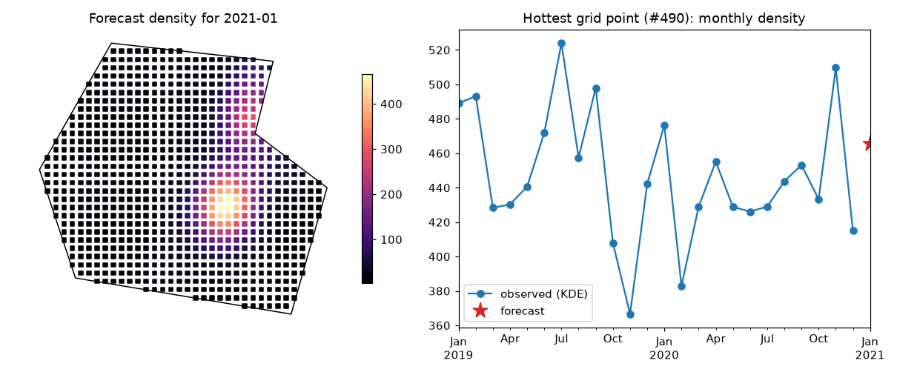

# Prediction and evaluation

[`PredictionPipeline`][predspot.ml_modelling.PredictionPipeline] ties the
mapping, the features and a scikit-learn estimator together.

## Fitting

```python
from sklearn.ensemble import GradientBoostingRegressor
from predspot import PredictionPipeline, PandasFeatureUnion
from predspot.crime_mapping import KDE, create_gridpoints
from predspot.feature_engineering import AR, Seasonality, Trend

pipeline = PredictionPipeline(
    mapping=KDE(tfreq="M", grid=create_gridpoints(study_area, resolution=1)),
    fextraction=PandasFeatureUnion([
        ("ar", AR(lags=3)),
        ("seasonal", Seasonality(lags=12)),
        ("trend", Trend(lags=12)),
    ]),
    estimator=GradientBoostingRegressor(random_state=0),
    random_state=0,
)
pipeline.fit(dataset)
```

`fit` computes the spatio-temporal series (`pipeline.stseries`), the feature
matrix (`pipeline.features`) and trains the estimator on every `(t, places)`
row whose target is known. Rows are shuffled (`random_state`) since the
estimator sees them as independent samples.

## Evaluating

```python
pipeline.evaluate("r2", cv=5)    # or "mse"
```

Periods are ordered and split with scikit-learn's `TimeSeriesSplit`, so each
fold trains on earlier periods and tests on later ones — no leakage from the
future. One score per fold is returned; the estimator is refitted on all the
data afterwards.

!!! note
    Scores measure how well the *density surface* of the next period is
    predicted at every place. For patrol planning you may care more about the
    ranking of places (e.g. hit rate of the top-*k* cells); compute it from
    `pipeline.predict()` against the series of the following period.

## Forecasting

```python
forecast = pipeline.predict()        # next period
forecast.head()
```

```
                   crime_density
t          places
2021-01-31 0               27.30
           1               46.43
```

Each `predict()` call appends its forecast to `pipeline.stseries`, recomputes
the features and advances `pipeline.next_time`, so repeated calls produce a
multi-step, recursive forecast. Join the result with `pipeline.grid` to map
it:

```python
hot = pipeline.grid.join(forecast.droplevel("t"))
top = hot.nlargest(20, "crime_density")     # top-20 places for patrol planning
hot.plot(column="crime_density", cmap="magma", markersize=12, legend=True)
```

<figure markdown="span">
  { width="900" }
</figure>

## Feature importances

When the estimator (or the last step of a `Pipeline`) exposes
`feature_importances_`, `pipeline.feature_importances` returns them by
feature name, accounting for a `FeatureSelection` step if present:

```python
pipeline.feature_importances.head()
```

## Modelling one crime type at a time

Different crime types have different dynamics; the usual approach is one
pipeline per `tag`:

```python
pipelines = {}
for tag, events in crimes.groupby("tag"):
    pipelines[tag] = build_default_pipeline(study_area).fit(Dataset(events, study_area))
```

## One-call helpers

[`predspot.pipeline`][predspot.pipeline] offers
[`build_default_pipeline`][predspot.pipeline.build_default_pipeline] (KDE on
points, seasonal/trend/diff features, quantile scaling, RFE selection and a
random forest) and
[`run_prediction_pipeline`][predspot.pipeline.run_prediction_pipeline], which
also filters by tag and time of day and fits in one go.
